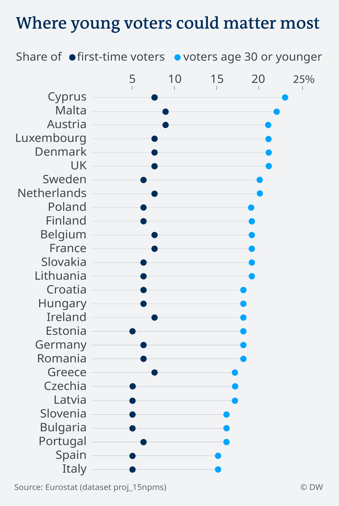

# Where can young voters swing the EU election?

You can read the story [here]()

Idea, data analysis, basic research: [Gianna-Carina Grün](https://twitter.com/giannagruen)

Research, interviews and writing: [Maximiliane Koschyk](https://twitter.com/maxkoschyk)

# Definitions

First time voters are people of 22 years of age (upper limit) or younger. The lower limit depends the voting age in different countries. For the majority of member states people are eligible to vote once they are 18 years old; exceptions are Greece (voting age is 17) and Malta and Austria (voting age is 16).

Source voting ages: [European Parliament](http://www.europarl.europa.eu/RegData/etudes/ATAG/2018/623556/EPRS_ATA(2018)623556_EN.pdf)

Data source population: Eurostat, population projections for 2019, baseline projection (DB entry ID [proj_15npms](http://appsso.eurostat.ec.europa.eu/nui/show.do?dataset=proj_15npms&lang=en))

Eligibility to vote is based solely on age in this analysis, other factors are not included. Thus, the results come with some inherit inaccuracy: absolute figures are likely to be lower. The share of first time voters however remains untouched by this inaccuracy as the ratio between the two remains unchanged.

Other [sources](https://www.idea.int/data-tools/data/voter-turnout) use the indicator "voting age population" which is defined as "the voting age population (VAP) includes all citizens above the legal voting age." which would generally support the above mentioned procedure.

However, it mentiones "all citizens" as part of the definition, so we reached back out to Eurostat to check their definition of population. Their reply: 

"The population data available in the Eurostat database are mainly referring to the concept of 'usual residence', that is the place where a person spend the daily rest. While this is the internationally recommended concept as well as the definition used in our EU regulations on demographic and migration statistics, the national data providers may also apply population definitions based on the 'legal' or 'registered' residence. You can find more information in our metadata on population statistics at: https://ec.europa.eu/eurostat/cache/metadata/en/demo_pop_esms.htm

Therefore, what it matters to include people in the 'usually resident population' is neither their legal status nor the citizenship, it is the duration of stay in the country for a period of at least a year."

# Results

First-time voters make up between 5 to 8 percent of the voting age population.
Looking at voters aged 30 or younger, they make up between 15 to 23 percent of the voting age population.

